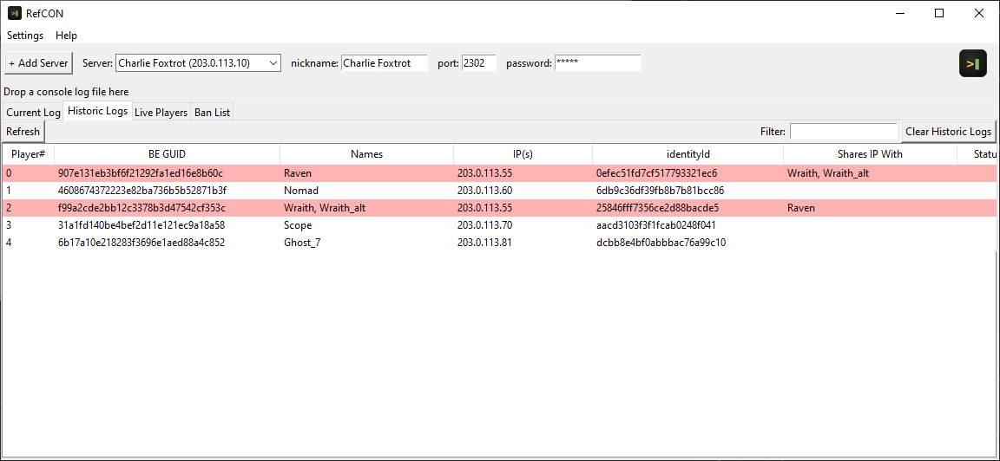

# RefCON

A lightweight, portable RCON tool for Arma Reforger. It talks to BattlEye's RCon (BERCON) so you can see who's connected, work your ban list, and send bans and unbans, all from one window instead of a raw RCon terminal. It also parses your server's console logs to catch players evading bans by reconnecting under a different account, which is where the tool started before it grew into full RCon management. Nothing about it phones home or sends your data anywhere else.


*Dummy data used for this screenshot.*

## Download

Grab `RefCON.exe` from the [Releases page](../../releases) and run it. No Python, no dependencies, nothing else to install. It's a single portable file, drop it anywhere and it'll write its own `data.json` next to itself.

Everything below this point is for running or building it from source instead.

## Requirements

Python 3.9 or newer, and one third-party package:

```
pip install -r requirements.txt
```

That installs `tkinterdnd2`, which is what makes drag-and-drop work. Everything else the GUI uses is in the Python standard library.

## Running from source

```
python gui.py
```

There's also a standalone command-line version of just the log parser, `altdetector.py`, useful for a quick one-off check or scripting a CSV export. It's a much thinner tool than the GUI, no RCon, no multi-server tracking, just a one-shot read of whichever log file you point it at.

```
python altdetector.py path/to/console.log
python altdetector.py path/to/console.log --csv out.csv
```

## How the GUI is laid out

### Servers

Drop a log for a server you haven't added yet and it appears in the dropdown automatically. Give it a nickname so it's easier to pick out later.

To set one up without dropping a log, use "+ Add Server" and enter the host, port, and password yourself.

### Current Log

Drag a console log onto this tab to see every account in that file: names, BE GUID, IPs, and whether another account shares an IP with them. Matches are highlighted red.

### Historic Logs

This is the same table, but for every log you've ever dropped in for the selected server, not just the last one. All of it is saved to `data.json` next to the app, so an alt that only shows up in a log from three weeks ago will still get flagged today. There's a "Clear Historic Logs" button if you want to wipe that history for a server and start over, and it asks for confirmation first because there's no undo.

Once you've pulled a ban list from RCon (see below), this tab also shows a Status column marking anyone in your history who's currently banned, matched by BE GUID, since that's the only thing the ban list gives you to link back to an account.

### Live Players

Click "Refresh from RCon" and it runs the `players` command against your server and shows everyone currently connected: IP, port, ping, GUID, and name. Anyone connected despite already being on the ban list gets highlighted. That shouldn't be possible, but if it happens, you want to know right away.

Tick the "Auto-refresh" checkbox next to that button and it keeps pulling the player list on its own every 5 seconds, so you're not sat there clicking refresh yourself. Change that interval from Settings > Live Players auto-refresh interval... in the menu bar.

### Ban List

Pulls your server's actual ban list over RCon (the `bans` command) and shows it as a table: ban number, whether it's a GUID or IP ban, the target, duration, and reason. Right-click a row to unban it.

### Filtering and sorting

Each tab has its own filter box in the top-right corner that narrows the table to rows matching whatever you type, checked against every column, not just names. Click any column heading to sort by it; numbers sort as numbers, everything else sorts alphabetically, and clicking again reverses the order.

### Right-click menu

On any player row, right-click gives you a "Copy" option for every column plus "Ban via RCon...", which opens a dialog asking for a reason and a duration in minutes (0 for permanent) before sending `addBan` to your server. It always asks you to confirm before sending anything, since this fires at your live server immediately with no undo.

## Alt detection

This is the feature the tool was originally built around, and it still drives the Current Log and Historic Logs tabs. The idea behind it: a PC ban sticks reasonably well, because a new Steam account means buying the game again. Console doesn't have that barrier. A new PSN or Xbox account costs nothing, so a banned player can be back on your server within minutes using the same console and a different account.

The console log already has what you need to catch that: the account's persistent ID, its BE GUID, and the IP it connected from. Nobody reads a raw log by hand to find it, though, a busy server's log runs into thousands of lines and the useful bits are buried in engine noise. This tool parses it for you, tracks every account it has ever seen per server, and flags any pair of accounts that have connected from the same IP. Ban someone, and if they reconnect twenty minutes later under a new name from the same address, you'll see both rows highlighted next time you open the app, even if the two sessions were logged weeks apart.

For every player it tracks: a BE player number, a persistent account ID (`identityId`, survives name changes), a BE GUID, a SteamID64 if they're on PC, every name they've played under, and every IP they've connected from.

## BERCON, not Reforger's built-in RCON

Reforger runs two separate RCon-like systems, and this tool only speaks one of them. BattlEye's own RCon, BERCON, is configured in `BEServer_x64.cfg` on your server and is what BEC, BattleMetrics, and this tool all talk to. Reforger also has a newer, separate built-in RCON configured through `config.json`, with its own port and password. They share the same wire protocol underneath, but the two are set up independently, so the port and password from one will not work with the other. If you already run RCon tooling and aren't sure which one it uses, check whether its settings came from `BEServer_x64.cfg` or `config.json`, that tells you which system it's talking to.

Your server needs BattlEye set up and running for any of this to work, if it isn't, there's no RCon to connect to. See [Arma Reforger: Server Hosting - BattlEye](https://community.bistudio.com/wiki/Arma_Reforger:Server_Hosting#BattlEye) for how to configure it.

The BERCON client is implemented from scratch in `be_rcon.py`, using nothing but the Python standard library (`socket`, `struct`, `zlib`). No admin password ever goes through a third party.

When you drop a log, the app pulls the BERCON port and password straight out of it, servers log their own `RConPort` and `RConPassword` on startup, plus the host from the "Server registered with address" line. If your log doesn't happen to contain that line, or you'd rather not drop a log at all, use "+ Add Server" and type the details in yourself.

RCon commands run on a background thread, so an unreachable server or a dropped packet won't freeze the window while it waits.

## Where your data lives

RefCON writes everything it learns to `data.json`, in the same folder as the app, or next to the `.exe` if you're running the packaged build. This file has your RCon passwords sitting in plain text, plus the full history of every player your servers have ever logged. Don't commit it to a repository or attach it to a bug report. Basically, don't share it with anyone you wouldn't hand your RCon password to directly.

If you're upgrading from an older copy of this tool that used separate `history.json` and `rcon_config.json` files, it folds them into `data.json` automatically the first time you run it, and only deletes the originals once it's verified the new file wrote correctly.

## Building a portable executable

```
pip install pyinstaller
pyinstaller RefCON.spec
```

Build from `RefCON.spec`, not a raw `pyinstaller gui.py` command, it bundles everything you need correctly.

The resulting `RefCON.exe` is fully self-contained, no Python installation needed on the machine running it. It writes `data.json` next to itself, wherever you put it, not into a temp folder, so your history survives between launches.

## Licence

GNU General Public License v3.0. See `LICENSE`.
